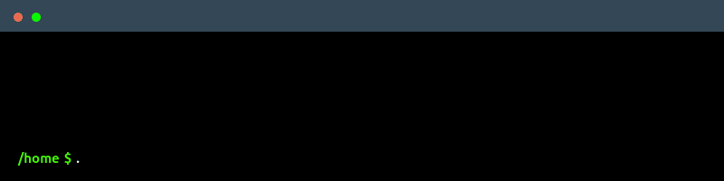

<p align="center">
  
  
  
  
  
  
</p>

<p align="center">
  
  
</p>

<p align="center">
  
</p>

## What is DNS-collector?

**DNS-collector** is a lightweight tool that captures DNS queries and responses from your DNS servers, processes them intelligently, and sends clean data to your monitoring, analytics and security systems.

What it does:
- **Captures at scale**: Ingests streams from BIND, PowerDNS, Unbound, etc., via high-speed [DNStap](https://dnstap.info/) protocol or live wire packet capture.
- **Filters & normalizes**: Discards noise (health checks, internal probes, spam) at wire speed before reaching storage.
- **Enriches on-the-fly**: Decorates records with GeoIP, ASN, threat intelligence, metadata, and custom tags.
- **Streams everywhere**: Dispatches batched events to ClickHouse, Kafka, Loki, Elasticsearch, Syslog, Prometheus, and more.

## Why DNS-collector?

The missing high-performance data collector between DNS servers and your SIEM/observability/analytics stack.

- **From Homelabs to Enterprises**: High-performance DNS telemetry pipeline with a lightweight footprint for any scale of DNS infrastructure (BIND, PowerDNS, Unbound, etc.)
- **DNS-Native & Edge Processing**: Understands EDNS, query types, latency tracking, and anonymizes user IPs before storage.
- **Flexible outputs**: Files, syslog, databases, monitoring tools and more...
- **Production ready**: Used in real networks, tested with major DNS servers
- **Enhanced DNStap**: TLS encryption, compression, and more metadata capabilities

## 🚀 Quick Start

Download the [latest release](https://github.com/dmachard/DNS-collector/releases) and create a simple [`config.yml`](config.yml) pipeline:

```yaml
pipelines:
  - name: tap
    dnstap:
      listen-ip: 0.0.0.0
      listen-port: 6000
    transforms:
      normalize:
        qname-lowercase: true
    routing-policy:
      forward: [ console ]
  - name: console
    stdout:
      mode: text
```

Default setup listens on tcp/6000 for DNStap streams and outputs to stdout.

Run the collector:

```bash
./dnscollector -config config.yml
```



## 📚 Documentation

| Topic | Description |
|-------|-------------|
| [📝 Formats](docs/formats.md) | Supported output formats (text, JSON, PCAP, Jinja2, etc.) |
| [🔧 Configuration](docs/configuration.md) | Complete config reference |
| [📥 Collectors](docs/collectors.md) | Input sources (network packet sniffer, DNStap server, etc.) |
| [📤 Loggers](docs/loggers.md) | Output destinations (Kafka, Prometheus, syslog, Loki, etc.) |
| [🔄 Transformers](docs/transformers.md) | Data enrichment options |
| [🐳 Docker](docs/docker.md) | Container deployment |
| [🔍 Examples](docs/examples.md) | Ready-to-use configs |
| [🔗 Sources & Sinks](docs/platforms/dns_servers.md) | Integration with popular tools and DNS servers |
| [⭐ Enhanced DNStap](docs/platforms/extended_dnstap.md) | Enhanced DNSTap features |
| [📊 Telemetry](docs/performance/metrics.md) | REST API and Prometheus metrics |
| [⚡ Performance Tuning](docs/performance/tuning.md) | Performance tuning guide |

## 👥 Contributions

Contributions are welcome!
Check out:
- [Contribution Guide](CONTRIBUTING.md)
- [Architecture Guide](docs/architecture.md)
- [Development Guide](docs/development.md)

## 🧰 Related Projects:

- [DNS-tester](https://github.com/dmachard/DNS-tester) - DNS testing toolkit
- [CoreDNS-GSLB](https://github.com/dmachard/coredns-gslb) - Global Server Load Balancing functionality in CoreDNS
