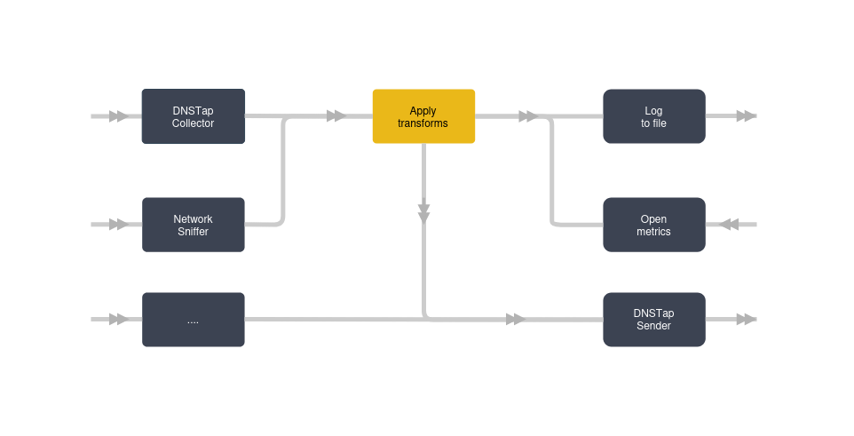
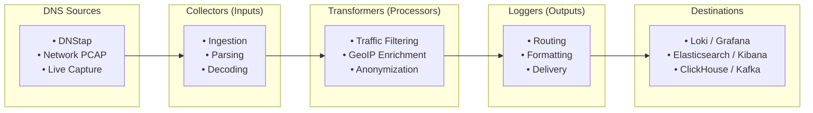

# Architecture

## Architecture Overview

DNS-collector is a flexible DNS logging and monitoring solution that operates on a worker-based architecture. Each worker can function as either a **collector** (data ingestion) or a **logger** (data output/processing).

The DNS-collector uses a pipeline architecture where:
- Workers can be chained together to create complex data processing pipelines
  - **Collectors** gather DNS data from various sources
  - **Loggers** process, transform, and output the collected data
- Transformers operate as stream processors that can be applied at two key points in your pipeline:
  - Input Processing: Applied to collectors to transform raw DNS data as it's ingested
  - Output Processing: Applied to loggers to modify data before it's stored or forwarded
  - Pipeline Chaining: Multiple transformers can be chained together for complex processing workflows

## Pipeline Flow

## DNS parser

A DNS parser is embedded to extract some informations from queries and replies.

The `UNKNOWN` string is used when the RCODE or RDATATYPES are not supported.

The following Rdatatypes will be decoded; otherwise, the `-` value will be used:

- A
- AAAA
- CNAME
- MX
- SRV
- NS
- TXT
- PTR
- SOA
- SVCB
- HTTPS

Extended DNS is also supported.
The following options are decoded:

- [Extended DNS Errors](https://www.rfc-editor.org/rfc/rfc8914.html)
- [Client Subnet](https://www.rfc-editor.org/rfc/rfc7871.html)

