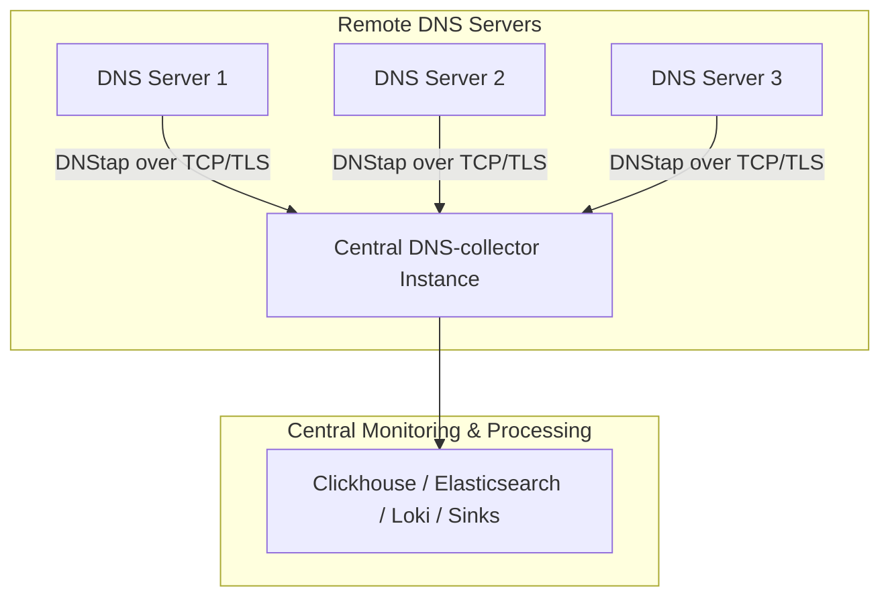

# Centralized Deployment

In this mode, multiple remote DNS servers stream their DNStap logs over network connections (TCP/TLS) to a single, centralized DNS-collector instance.

This architecture simplifies maintenance and concentrates resources, as only one centralized pipeline and transformation engine needs to be managed.

## Architecture Diagram

