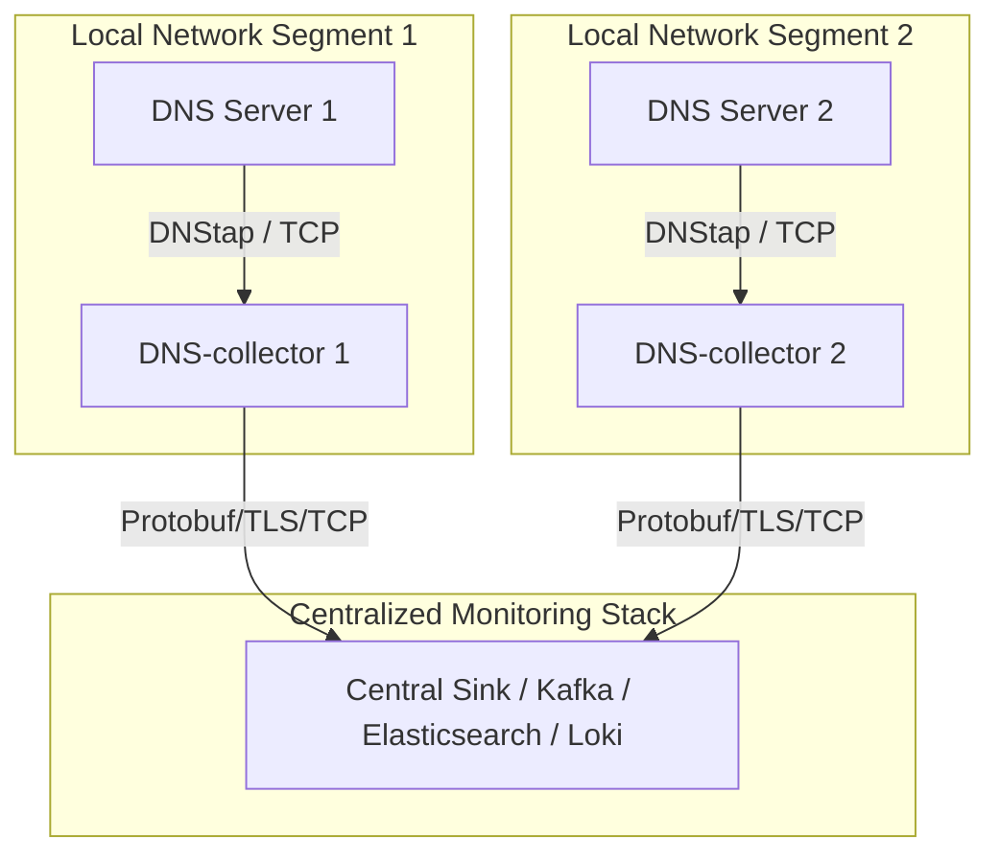

# Edge Deployment

This architecture is ideal for minimizing network latency, performing edge filtering, and carrying out local preprocessing before sending telemetry over the network.

## Architecture Diagram

