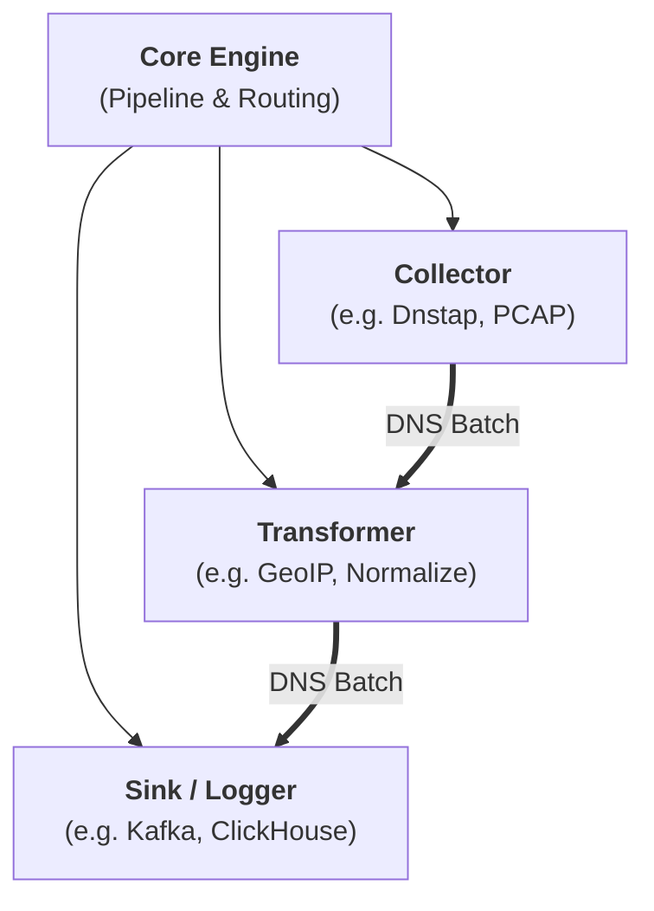

# Extending DNS-collector

DNS-collector is designed to be easily extensible. You can extend its capabilities in two main ways:

- **[Adding a Worker (Collector or Logger)](extending_workers.md)**: Add new input sources (collectors like Dnstap, PCAP, sockets) or output sinks (loggers like Kafka, Elasticsearch, Syslog).
- **[Adding a Transformer](extending_transformers.md)**: Add custom packet manipulation, enrichment, GeoIP lookups, or filtering logic.

---

## Architecture Overview

Explore the detailed step-by-step guides below:

- 📖 **[How-to: Add a Worker (Collector / Logger)](extending_workers.md)**
- 📖 **[How-to: Add a Transformer](extending_transformers.md)**
