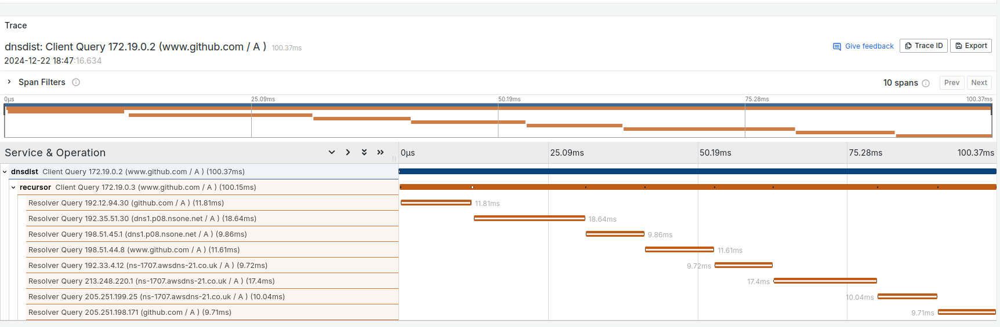
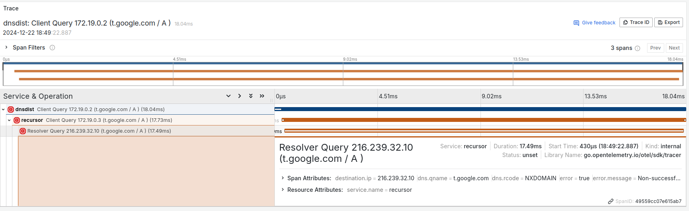

# Logger: OpenTelemetry

OpenTelemetry plugin Logger

**Experimental**: This feature is experimental and currently works only with the DNSDist and Recursor products from PowerDNS.

> **Note**: As an experimental component, OpenTelemetry is **not included in default builds nor in official precompiled release binaries**. To use it, you must compile from source with `make build-experimental` or `go build -tags experimental dnscollector.go`.

## Options

* `otel-endpoint` (string)
  > Specifies the endpoint for sending telemetry data to an OpenTelemetry collector. 
  > The endpoint should be specified in the format `host:port`.

Default values:

```yaml
opentelemetry:
  otel-endpoint: ""
```

### Example of result with Tempo from Grafana



### Example with DNS error (NXDOMAIN)


