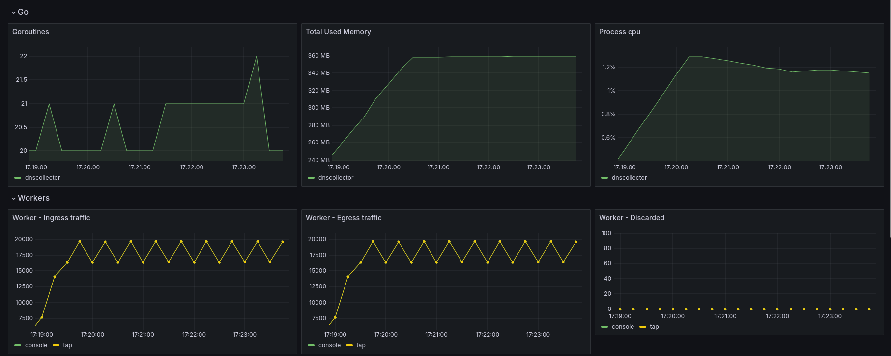

# Telemetry & Monitoring

DNS-collector exposes extensive internal telemetry metrics, allowing you to monitor the health, performance, CPU usage, memory allocations, and active goroutines of the DNS-collector process itself.

## Why Enable Telemetry?

By enabling process telemetry, you gain real-time visibility into:
- Ingress and egress message rates per pipeline worker.
- Dropped and discarded message counts (crucial for buffer sizing and bottleneck detection).
- System resource usage (CPU, memory allocations, garbage collection cycles, active goroutines count).

---

## How to Enable Telemetry

To start exposing Prometheus metrics, enable telemetry in the `global` section of your configuration:

```yaml
global:
  telemetry:
    enabled: true
    web-listen: ":9165"
    web-path: "/metrics"
    prometheus-prefix: "dnscollector"
```

Once enabled, you can access the raw Prometheus metrics at `http://localhost:9165/metrics` and point your Prometheus scraper to this endpoint.

---

## Grafana Dashboard

To help visualize the internal metrics of the DNS-collector binary, a pre-configured Grafana dashboard is available:

* **Go Runtime Exporter Dashboard** — Tracks CPU usage, memory allocations, garbage collection cycles, and active goroutines of the DNS-collector process.

You can download the raw dashboard configuration directly:

<a href="https://raw.githubusercontent.com/dmachard/DNS-collector/main/docs/dashboards/grafana_exporter.json" class="btn-primary" style="display: inline-block; margin-top: 0.5rem; margin-bottom: 1.5rem; text-decoration: none;">Download JSON</a>

### Dashboard Preview


---

## Process Performance Metrics

In addition to standard Go runtime metrics, the telemetry endpoint exposes internal pipeline metrics to track performance and detect bottlenecks:

### Pipeline & Worker Throughput

- **`dnscollector_worker_ingress_traffic_total`**  
  Total number of DNS messages received by each pipeline worker. This reflects successful handoff to the next internal processing stage.
  
- **`dnscollector_worker_egress_traffic_total`**  
  Total number of DNS messages successfully forwarded out by each worker. *Note: This does not guarantee delivery to remote external systems.*
  
- **`dnscollector_worker_discarded_traffic_total`**  
  The number of messages dropped when worker output channels/buffers are full (e.g., due to slow loggers or network bottlenecks).

- **`dnscollector_policy_forwarded_total`**  
  Total number of DNS messages forwarded after matching policy rules.

- **`dnscollector_policy_dropped_total`**  
  Total number of DNS messages dropped by active policy rules.
