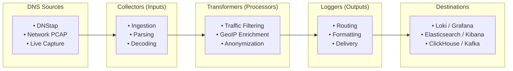

# Pipeline Routing

DNS-collector's architecture is modular and built around three distinct types of components that can be chained together inside a pipeline:

* **Collectors (Inputs)**: Capture, sniff, or receive DNS traffic from various live streams (DNStap, PCAP network captures, UNIX/TCP sockets, tailing files, etc.).
* **Transformers (Processors)**: Intercept DNS message streams to perform inline normalization, traffic filtering, GeoIP enrichment, lowercasing, relabeling, and user privacy anonymization.
* **Loggers (Outputs)**: Output, route, and store the collected DNS events into file logs, databases (ClickHouse, InfluxDB), log management engines (Loki, Elasticsearch), message queues (Kafka, Redis), or dashboard systems.

Each component is configured under its respective section within a pipeline, allowing you to build extremely flexible data flow routing topologies.

## Pipeline Flow

Here is a visual overview of how DNS data flows from its sources, through collectors and transformers, to the loggers and final destinations:



## Basic Pipeline Structure

```yaml
pipelines:
  - name: "unique-pipeline-name"
    # Collector OR Logger configuration
    collector-type:
      # collector settings
    
    # Optional: data transformations
    transforms:
      - type: "transformer-name"
        # transformer settings
    
    # Required: routing policy
    routing-policy:
      forward: ["next-pipeline-name"]  # Success path
      dropped: ["error-pipeline-name"] # Error path (optional)
```

## Common Pipeline Examples

### DNStap Input → Multiple Outputs

```yaml
pipelines:
  - name: "dnstap-collector"
    dnstap:
      listen-ip: "0.0.0.0"
      listen-port: 6000
    routing-policy:
      forward: ["json-file", "console-debug"]
      dropped: ["error-log"]

  - name: "json-file"
    logfile:
      file-path: "/var/log/dns/queries.json"
      mode: "json"

  - name: "console-debug"
    stdout:
      mode: "text"

  - name: "error-log"
    logfile:
      file-path: "/var/log/dns/errors.log"
      mode: "text"
```

### Network Capture → Processing → Storage

```yaml
pipelines:
  - name: "network-capture"
    pcap:
      device: "eth0"
      port: 53
    transforms:
      - type: "geoip"
        mmdb-country-file: "/path/to/country.mmdb"
    routing-policy:
      forward: ["elasticsearch-output"]

  - name: "elasticsearch-output"
    elasticsearch:
      server: "https://localhost:9200"
      index: "dns-logs"
      tls-insecure: true
```
