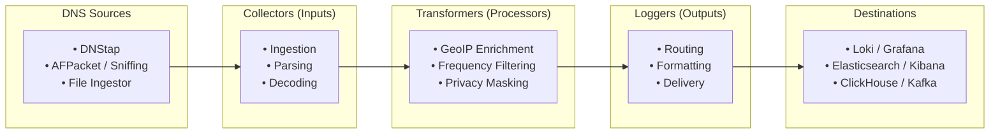

# Pipeline Routing

DNS-collector's architecture is modular and built around three distinct types of components that can be chained together inside a pipeline:

* **Collectors (Inputs)**: Capture, sniff, or receive DNS traffic from various live streams (DNStap, AFPacket / live network sniffing, UNIX/TCP sockets, file ingestors, tailing logs, etc.).
* **Transformers (Processors)**: Intercept DNS message streams inline to perform normalization, traffic filtering, GeoIP enrichment, lowercasing, relabeling, privacy masking, or frequency filtering.
* **Loggers (Outputs)**: Output, route, and store the collected DNS events into file logs, console (stdout), analytical databases (ClickHouse, InfluxDB), log management engines (Loki, Elasticsearch), message queues (Kafka, Redis), or monitoring metrics (Prometheus, Top-N).

Each component is configured within a pipeline stanza, allowing you to build flexible data flow routing topologies.

---

## Pipeline Flow



---

## Basic Pipeline Structure

A pipeline stanza defines an **Input (Collector)** or an **Output (Logger)**, optional **Transformers**, and a **Routing Policy**:

```yaml
pipelines:
  # Ingestion Stanza (Collector)
  - name: "my-collector"
    dnstap:
      listen-ip: "0.0.0.0"
      listen-port: 6000

    # Optional: inline transformations
    transforms:
      normalize:
        enable: true
        qname-lowercase: true
      geoip:
        enable: true
        mmdb-country-file: "/etc/GeoLite2-Country.mmdb"

    # Required for collectors: routing policy
    routing-policy:
      forward: [ "my-logger" ]       # Processed stream
      dropped: [ "dropped-logger" ]  # Dropped/Filtered stream (optional)

  # Output Stanza (Logger)
  - name: "my-logger"
    stdout:
      mode: "text"
```

---

## Common Pipeline Examples

### 1. DNStap Input → Multiple Outputs (Fan-out)

In this example, incoming DNStap traffic is split and delivered simultaneously to a JSON log file and to Prometheus metrics:

```yaml
pipelines:
  - name: "dnstap-ingest"
    dnstap:
      listen-ip: "0.0.0.0"
      listen-port: 6000
    routing-policy:
      forward: [ "json-file", "prom-metrics" ]

  - name: "json-file"
    logfile:
      file-path: "/var/log/dns/queries.json"
      mode: "json"

  - name: "prom-metrics"
    prometheus:
      listen-ip: "0.0.0.0"
      listen-port: 9165
```

---

### 2. Live Network Sniffing (AFPacket) → GeoIP & Frequency Filtering → Loki

In this example, live DNS packets are captured on network interface `eth0`, enriched with GeoIP metadata, downsampled with `frequency-filtering`, and forwarded to Grafana Loki:

```yaml
pipelines:
  - name: "live-capture"
    afpacket:
      interface: "eth0"
      port: 53
    transforms:
      geoip:
        enable: true
        mmdb-country-file: "/etc/GeoLite2-Country.mmdb"
      frequency-filtering:
        enable: true
        target: "qname"
        threshold-heavy: 1000
        action-on-heavy: "sample"
        sample-rate: 100
    routing-policy:
      forward: [ "loki-output" ]

  - name: "loki-output"
    lokiclient:
      server-url: "http://loki:3100/loki/api/v1/push"
      job-name: "dnscollector"
      mode: "flat-json"
```

---

### 3. File Ingestion → ElasticSearch + Error Isolation

In this example, PCAP or log files are ingested, normalized, and streamed into Elasticsearch, while dropped or unparseable queries are stored in a separate error file:

```yaml
pipelines:
  - name: "file-collector"
    file-ingestor:
      watch-dir: "/var/log/dns/incoming/"
      pcap-filter: "port 53"
    transforms:
      normalize:
        enable: true
        qname-lowercase: true
    routing-policy:
      forward: [ "elasticsearch-output" ]
      dropped: [ "error-log" ]

  - name: "elasticsearch-output"
    elasticsearch:
      url: "http://elasticsearch:9200"
      index: "dns-logs"
      bulk-size: 500

  - name: "error-log"
    logfile:
      file-path: "/var/log/dns/errors.log"
      mode: "text"
```
