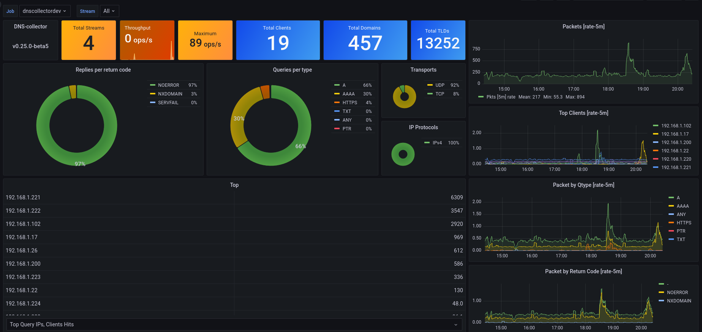
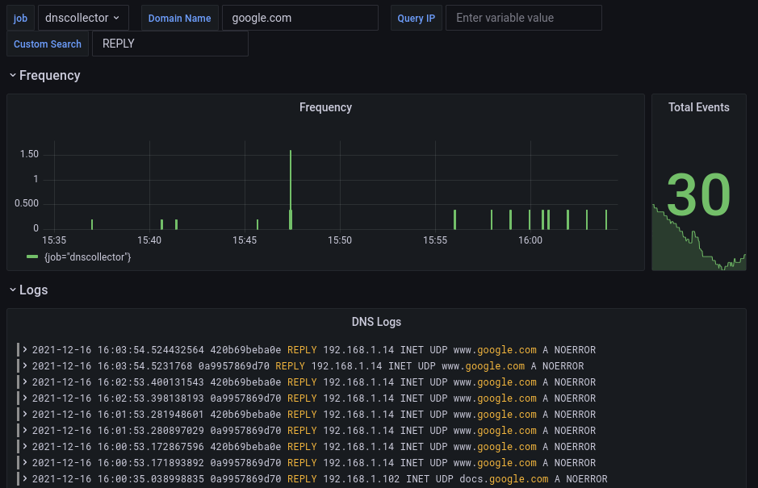

# Telemetry & Monitoring

DNS-collector exposes extensive telemetry metrics, allowing you to monitor pipeline health, traffic throughput, error rates, and resource utilization in real-time.

## Grafana Dashboards

Pre-configured Grafana dashboards are available in the repository. You can import these directly into your Grafana instance to monitor your DNS pipelines:

<div class="grid-2-cols" style="margin-top: 1.5rem; margin-bottom: 2rem;">

  <div class="feature-box">
    <h3>Prometheus Metrics</h3>
    <p>Provides a comprehensive view of DNS query types, RCODE distribution, latency statistics, and worker queue depths.</p>
    <a href="https://raw.githubusercontent.com/dmachard/DNS-collector/main/docs/dashboards/grafana_prometheus.json" class="btn-primary" style="display: inline-block; margin-top: 1rem; text-decoration: none;">Download JSON</a>
  </div>

  <div class="feature-box">
    <h3>Loki Log Analytics</h3>
    <p>Visualizes query details, client distribution, TLDs, and allows real-time searching through DNS logging streams.</p>
    <a href="https://raw.githubusercontent.com/dmachard/DNS-collector/main/docs/dashboards/grafana_loki.json" class="btn-primary" style="display: inline-block; margin-top: 1rem; text-decoration: none;">Download JSON</a>
  </div>

  <div class="feature-box">
    <h3>Go Runtime Exporter</h3>
    <p>Tracks CPU usage, memory allocations, garbage collection cycles, and active goroutines of the DNS-collector process.</p>
    <a href="https://raw.githubusercontent.com/dmachard/DNS-collector/main/docs/dashboards/grafana_exporter.json" class="btn-primary" style="display: inline-block; margin-top: 1rem; text-decoration: none;">Download JSON</a>
  </div>

</div>

---

## Enabling Metrics (Prometheus)

To start exposing Prometheus metrics, enable telemetry in the `global` section of your configuration:

```yaml
global:
  telemetry:
    enabled: true
    web-listen: ":9165"
    web-path: "/metrics"
    prometheus-prefix: "dnscollector"
```

Once enabled, you can access the raw Prometheus metrics at `http://localhost:9165/metrics` and point your Prometheus scraper to this endpoint.

---

## Dashboard Previews

### Prometheus Metrics Dashboard


### Go Runtime Exporter Dashboard


### Loki Log Analytics Dashboard

